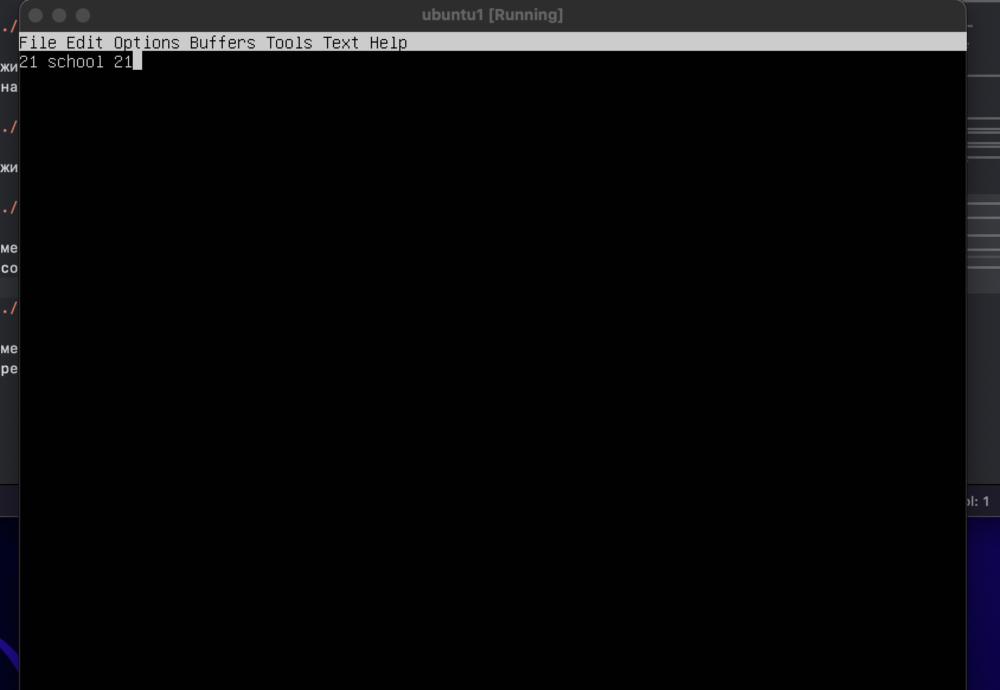
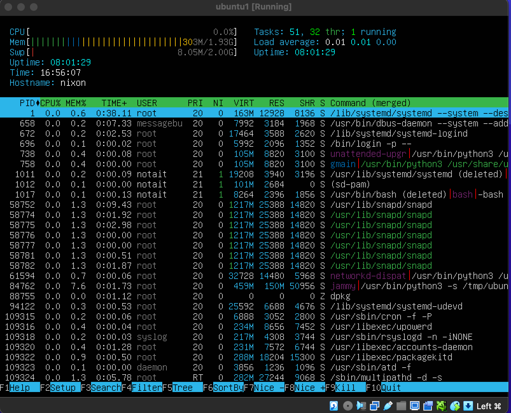

# Операционные системы UNIX/Linux (Базовый).

## Part 1. Установка ОС


## Part 2. Создание пользователя


## Part 3. Настройка сети ОС

Интерфейс lo (Loopback interface) представляет собой виртуальный сетевой интерфейс, который предназначен для взаимодействия со сетью на уровне TCP/IP на том же компьютере, где он находится. Этот интерфейс позволяет отправлять сетевой трафик и принимать его, не требуя физического подключения к сети. Интерфейс lo обычно имеет адрес IP 127.0.0.1 (localhost), который используется  для обращения к себе, а также для тестирования и отладки сетевых приложений. Он очень важен для работы сетевых услуг и служб на компьютере, таких как DNS, маршрутизация и многое другое.

DHCP расшифровывается как "Dynamic Host Configuration Protocol". Это протокол, используемый в компьютерных сетях для автоматической настройки сетевых параметров устройств, таких как IP-адреса, подсети, шлюза и других параметров. DHCP позволяет сетевым устройствам автоматически получать необходимую информацию для работы в сети, упрощая процесс конфигурации сети и избегая конфликтов с IP-адресами.

- прописал команду  чтоб назвать 
```sh
sudo hostnamectl set-hostname user-1
```
- Прописал команду для установки врменной зоны текущему местоположению
```sh
sudo timedatectl set-timezone Europe/Moscow
```

- использовал команду `curl ifconfig.me` чтобы узнать внешний ip адрес
- использовал команду `curl ip addr` чтобы узнать внутренний ip адрес

- прописал след команду и добавил изменения 
```sh
sudo nano /etc/netplan/00-installer-config.yaml
```


- перезагрузил виртуалку и убедился, что статичные сетевые настройки (ip, gw, dns) соответствуют заданным в предыдущем пункте.


## Обновление ОС


## Использование команды sudo

- Команда sudo в Unix-подобных операционных системах, предоставляет механизм контролируемого повышения привилегий. 

1. Временное повышение привилегий: `sudo` позволяет авторизованным пользователям выполнять команды от имени другого пользователя, чаще всего суперпользователя (`root`), без необходимости знать его пароль.

2. Контроль и аудит:  Использование `sudo` позволяет вести журнал действий, выполненных с повышенными привилегиями.  Это повышает безопасность системы, позволяя отслеживать, кто и когда выполнял команды от имени `root`.

3. Гибкая настройка:  Администратор системы может настроить `sudo` для предоставления пользователям доступа к определенным командам или наборам команд, ограничивая 


## Установка и настройка службы времени


## Установка и использование текстовых редакторов


- Ввожу свой никнейм и нажимаю Ctrl+X, затем Y и Enter для сохранения изменений и выхода из редактора.


- Нажимаю клавишу i для входа в режим вставки, ввожу свой никнейм, затем нажимаю Esc, ввожу :wq и нажимаю Enter для сохранения изменений и выхода из Vim.


- Нажимаю клавишу Ctrl+X Ctrl+S для сохранения файла, затем Ctrl+X Ctrl+C для закрытия Emacs.


- Заменяю свой никнейм на строку "21 School 21". Затем нажимаю Ctrl+X, затем N для отказа от сохранения изменений и выхода из редактора.


- Заменяю свой никнейм на строку "21 School 21". Затем нажимаю Esc, ввожу :q! для выхода из редактора без сохранения изменений.



- Заменяю свой никнейм на строку "21 School 21". Затем нажимаю Ctrl+X Ctrl+C для выхода из Emacs без сохранения изменений.


- Для замены слова в Nano использую сочетание Ctrl\, затем ввожу слово для поиска ("school") и слово для замены ("nano"). Произвожу замену. Затем нажимаю Ctrl+X, Y для сохранения изменений и выхода из редактора.


- Для замены слова в Vim использую команду :%s/School/vim/g, где School - слово для поиска, vim - слово для замены. Затем нажимаю Esc, ввожу :wq для сохранения изменений и выхода из Vim


- Для замены слова в Emacs использую команду M-x replace-string, затем ввожу слово для поиска и слово для замены. Произвожу замену. Затем нажимаю Ctrl+X Ctrl+S для сохранения изменений и Ctrl+X Ctrl+C для выхода из Emacs.


## Установка и базовая настройка сервиса SSHD

- установил SSHd
```sh
sudo apt-get install ssh
```


- Суть работы команды ps в том, что она собирает данные из специальной директории /etc/proc, в которой находятся сведения о процессах и представляет их в удобной форме для восприятия.
- `ps -ef`: этот флаг `e` показывает все процессы, а флаг `f` выводит полную информацию о процессах.
- |: это оператор конвейера (pipe), который передает вывод команды `ps -ef` на вход команды grep.
- `grep sshd`: это команда grep используется для фильтрации строк вывода, чтобы оставить только те строки, которые содержат sshd.


- `-tan`: это сочетание ключей и их значения:
`-t`: отображает только TCP соединения.
`-a`: отображает все соединения, включая активные и прослушивающие сокеты.
`-n`: выводит числовые значения вместо символьных (например, IP-адресов и портов).

- Выходная информация netstat -tan включает в себя столбцы с различными значениями:

Proto: протокол передачи данных (например, TCP).
Recv-Q: количество байт, ожидающих чтения.
Send-Q: количество байт, ожидающих отправки.
Local Address: локальный IP-адрес и порт сервера.
Foreign Address: внешний IP-адрес и порт удаленного хоста.
State: текущее состояние сетевого соединения (например, ESTABLISHED, LISTENING).

- Значение 0.0.0.0 имеет особое значение для Local Address. В данном контексте, когда адрес 0.0.0.0 указывается как локальный адрес, это означает "любой IP-адрес" на сервере. Процесс, связанный с этим сокетом, будет слушать все доступные сетевые интерфейсы на указанном порту.

## Установка и использование утилит top, htop


- Uptime: 6:03 (система работает 6 часов и 3 минуты).
- Количество авторизованных пользователей: 1 пользователь.
- Общая загрузка системы: 0.00, 0.00, 0.00 (за последние 1, 5 и 15 минут соответственно).
- Общее количество процессов: 124 процесса (из них 1 запущен, 122 спят, 0 остановлены, 1 зомби).
- Загрузка CPU:
us (user): 0.0%
sy (system): 0.0%
ni (nice): 0.0%
id (idle): 100.0%
wa (I/O wait): 0.0%
hi (hardware interrupts): 0.0%
si (software interrupts): 0.0%
st (steal time): 0.0%
- Загрузка памяти:
Общая память: 2048.0 MB
Использовано: 523.9 MB
Свободно: 1424.1 MB
Буферы/кэш: 100.0 MB
- PID процесса, занимающего больше всего памяти: PID 1, использует 0.6% MEM.
- PID процесса, занимающего больше всего процессорного времени: PID 1 , использует 0:38.02 TIME+.




##  Использование утилиты fdisk

- Название жесткого диска: VBOX HARDDISK
- Размер жесткого диска: 25G
- Количество секторов: 52428800
- размер swap составляет 2.0G.

## Использование утилиты df

- Запусти команду `df`.

Размер раздела: 1992552 K 
Размер занятого пространства: 229904K
Размер свободного пространства: 1641408K 
Процент использования: 13%
Единица измерения в выводе:K.

- Запусти команду `df -Th`.

Размер раздела: 2.0G
Размер занятого пространства: 225M
Размер свободного пространства: 1.6G
Процент использования: 13%
Тип файловой системы: ext4


## Использование утилиты du


## Установка и использование утилиты ncdu


## Работа с системными журналами

- June 5 18:33:46
- user-1 sudo: notait
- password


## Использование планировщика заданий CRON


